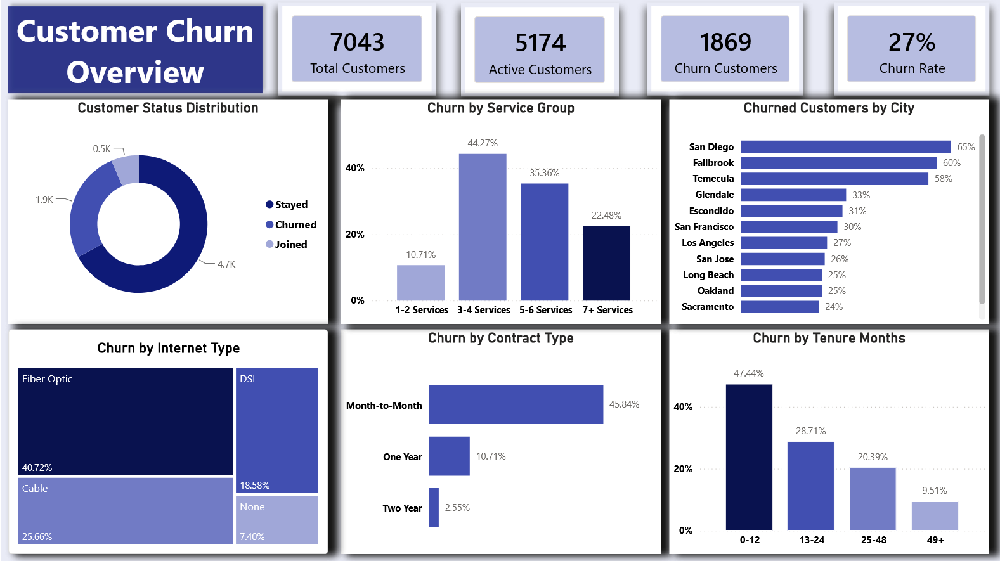
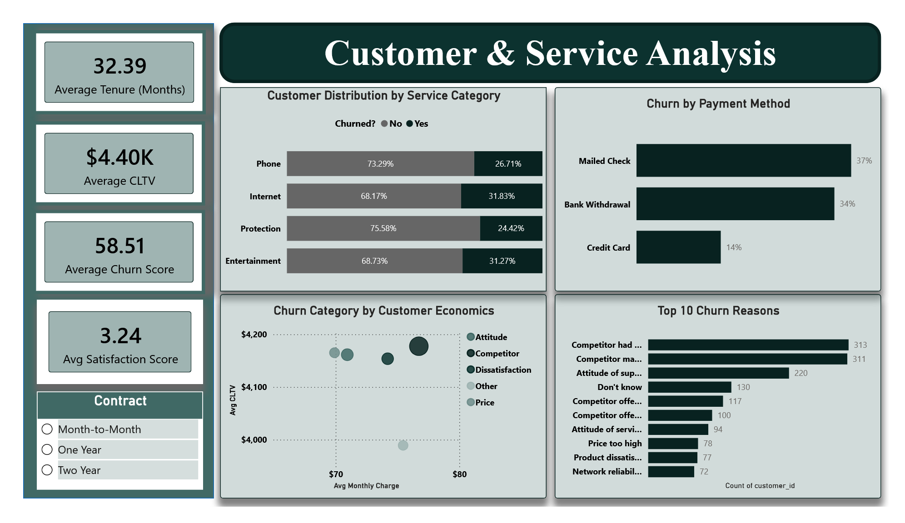
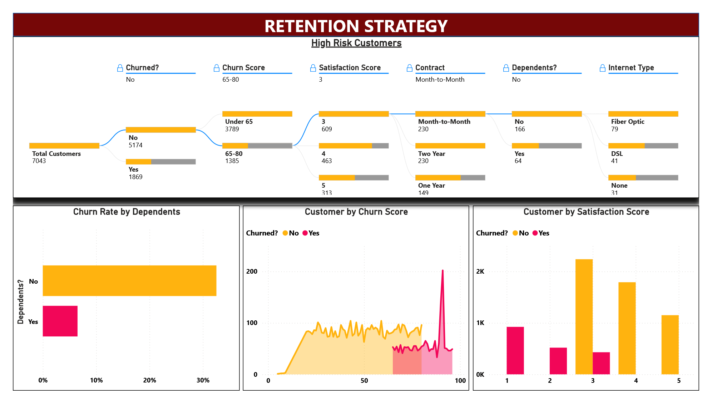

# Telco Customer Churn Analysis

## Project Overview

Customer churn is one of the biggest challenges faced by telecom companies. Acquiring a new customer is often more expensive than retaining an existing one, making churn analysis critical for business growth.

In this project, I analyzed customer behavior, service usage patterns, contract types, payment methods, customer satisfaction, and churn risk indicators to identify the key factors driving customer attrition and recommend retention strategies.

### Tools Used

* MySQL
* Power BI
* Power Query

### Dataset Source

This project uses the [Kaggle - Telco Customer Churn (11.1.3+) Dataset](https://www.kaggle.com/datasets/ylchang/telco-customer-churn-1113) dataset, originally provided as part of IBM Cognos Analytics sample datasets and made available through Kaggle. The dataset contains customer demographics, location information, subscribed services, customer status, satisfaction scores, churn scores, and Customer Lifetime Value (CLTV) metrics for 7,043 telecom customers.

---

## Data Preparation

### SQL Data Cleaning & Transformation

The raw data was imported into MySQL from multiple CSV files.

Key preparation steps included:

* Importing 5 source CSV files
* Data validation and standardization
* Handling missing values
* Creating relationships across tables
* Preparing analytical datasets for Power BI
* Building service-category groupings through data transformation

### Data Preprocessing & Validation

The dataset was provided as five separate CSV files containing customer demographics, location details, services, population data, and churn status information. These files were imported into MySQL and validated before being used for analysis.

### Key Preprocessing Steps

* Imported all source files into MySQL using the Data Import Wizard.
* Standardized column names by converting them from **Title Case** to **snake_case** to improve consistency and query readability.
* Validated row counts and unique `customer_id` values across customer-level tables to ensure data integrity.
* Checked critical fields for missing values and verified that no major data quality issues existed.
* Confirmed successful joins between the Demographics, Location, Services, and Status tables using `customer_id`.

### Power BI Transformations

After data validation, the cleaned tables were loaded into Power BI for modeling and analysis.

Additional transformations included:

* Creating relationships between tables.
* Unpivoting service-related columns to enable service-level analysis.
* Grouping individual services into broader categories such as Internet Services, Phone Services, Protection Services, and Entertainment Services.

---

# Dashboard 1: Churn Overview

## Business Objective

Identify which customer segments, services, and contract types are contributing most to customer churn.

### Key KPIs

| Metric            | Value |
| ----------------- | ----- |
| Total Customers   | 7,043 |
| Active Customers  | 5,174 |
| Churned Customers | 1,869 |
| Churn Rate        | 27%   |

### Key Insights

#### Service Adoption vs Churn

Customers subscribed to only 3–4 services exhibited the highest churn rate.

As customers adopted more services, churn rates decreased, suggesting that deeper engagement increases customer retention.

#### Geographic Analysis

The highest churn concentrations were observed in:

* San Diego
* Fallbrook
* Temecula

These locations may require targeted retention campaigns.

#### Internet Service Type

Customers using Fiber Optic internet showed approximately 40% churn.

Fiber Optic customers represent one of the highest-risk customer segments.

#### Contract Type

Month-to-Month customers were significantly more likely to churn compared to customers on longer-term contracts.

#### Customer Tenure

Customers with less than one year of tenure demonstrated substantially higher churn rates than long-term customers.

---

# Dashboard 2: Customer & Service Analysis

## Business Objective

Understand customer value, satisfaction, service usage patterns, and reasons behind churn.

### Key KPIs

| Metric                     | Value     |
| -------------------------- | --------- |
| Average Tenure             | 32 Months |
| Average CLTV               | $4.4K     |
| Average Churn Score        | 58.5      |
| Average Satisfaction Score | 3.24      |

### KPI Definitions

#### Customer Lifetime Value (CLTV)

CLTV is a predictive metric estimating the total future value of a customer relationship.

Higher CLTV indicates more valuable customers.

#### Churn Score

Churn Score is a predictive score ranging from 0–100 generated using IBM SPSS Modeler.

Higher scores indicate a greater likelihood of churn.

### Key Insights

#### Service Category Analysis

Using Power Query unpivot transformations, individual telecom services were grouped into broader service categories.

Analysis showed:

* Internet Services exhibited high churn.
* Entertainment Services showed similarly elevated churn levels.

#### Payment Method Analysis

Customers paying through Credit Card demonstrated the lowest churn rates.

#### Customer Economics

Comparing Monthly Charges and CLTV revealed that many high-value customers cited:

* Competitor offerings
* Customer service attitude

as their primary reasons for leaving.

#### Churn Reasons

The two most common churn reasons were:

1. Competitor
2. Attitude

This suggests both competitive pressure and customer experience issues are major business concerns.

---

# Dashboard 3: Retention Strategy

## Business Objective

Identify customers most at risk of churning and define actionable retention strategies.

### Risk Segmentation Using Churn Score

Analysis of non-churned customers showed:

* Customers below a churn score of 65 generally remained active.
* Customers with churn scores between 65–80 began showing elevated churn behavior.

This segment was identified as the primary at-risk customer group.

### Satisfaction Score Analysis

Customer satisfaction emerged as a strong churn indicator.

Observations:

* Satisfaction scores of 1 and 2 were strongly associated with churn.
* Satisfaction scores of 4 and 5 showed very low churn.
* Customers with satisfaction score 3 represented the largest at-risk segment.

### Contract Type Focus

Month-to-Month customers consistently demonstrated higher churn risk and should be prioritized for retention initiatives.

### Dependents Analysis

Customers without dependents showed significantly higher churn compared to customers with dependents.

This customer segment presents another opportunity for targeted retention efforts.

### Internet Service Focus

Fiber Optic customers churned substantially more than DSL customers.

Further investigation into service quality, pricing, and customer experience for Fiber Optic customers is recommended.

---

# Dashboard 4: Key Influencers Analysis

## Business Objective

Identify the strongest factors influencing customer churn using Power BI's Key Influencers visual.

### Key Findings

#### Contract Type

Customers on Month-to-Month contracts are:

**7× more likely to churn**

than customers on long-term contracts.

#### Dependents

Customers without dependents are:

**5× more likely to churn**

than customers with dependents.

#### Satisfaction Score

Customers with satisfaction ratings of:

* 1
* 2

are highly likely to churn or have already churned.

#### Churn Score

Customers with churn scores above:

**80**

represent the highest-risk churn segment.

---

# Skills Demonstrated

* SQL Data Cleaning
* Data Modeling
* Power Query Transformations
* Customer Segmentation
* Churn Analysis
* Predictive KPI Interpretation
* Dashboard Design
* Business Intelligence
* Data Storytelling
* Retention Strategy Development
