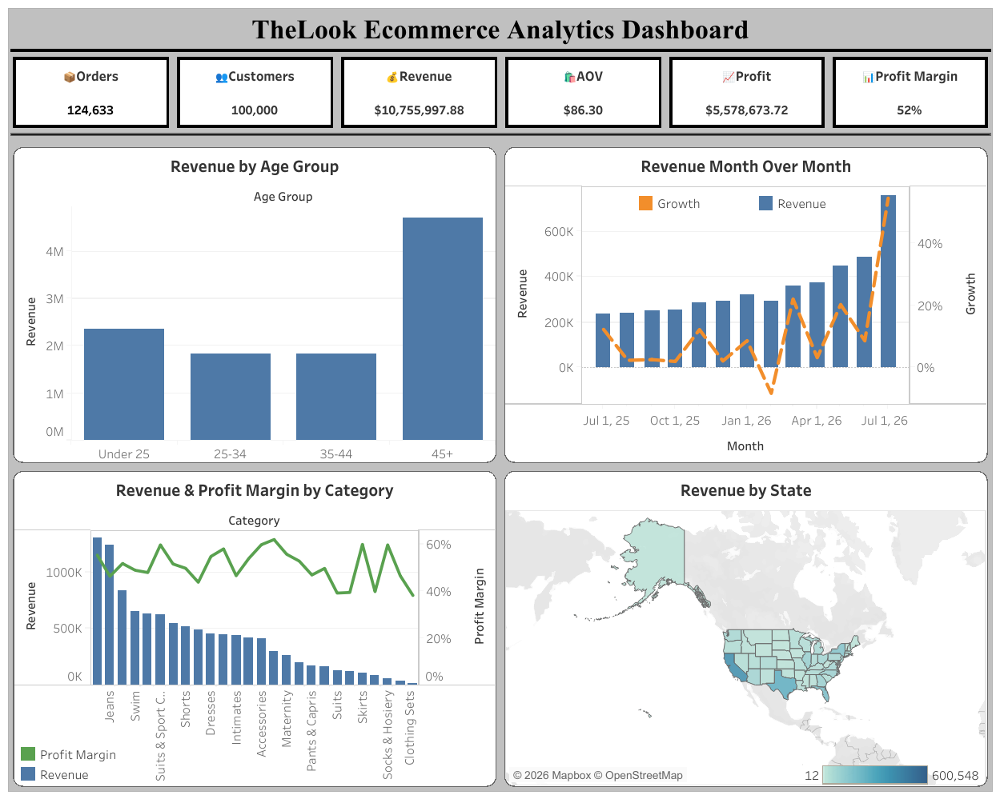

# TheLook Ecommerce Sales & Customer Analytics

## Overview

This project analyzes ecommerce sales, customer behavior, product performance, and geographic trends using **TheLook Ecommerce** dataset from Google BigQuery Public Datasets.

The objective was to perform end-to-end business analysis using SQL and transform the findings into an interactive Tableau dashboard that enables stakeholders to monitor key business metrics and identify growth opportunities.

---

## Dataset

**Source:** Google BigQuery Public Dataset – TheLook Ecommerce

The dataset contains information on:

* Customers
* Orders
* Orders Items
* Products

The analysis focuses on sales performance, customer purchasing patterns, product profitability, and regional revenue distribution.

**Last Updated:** 21 July 2026

---

## Tools Used

* Google BigQuery
* SQL
* Tableau Public

---

## Project Workflow

### 1. Data Exploration

Explored and joined multiple tables from the dataset to understand relationships between customers, orders, products, and geographic locations.

### 2. SQL Analysis

Business questions were answered through SQL queries organized into separate analysis files:

* [data_exploration.sql](./sql/data_exploration.sql)
* [combined_kpi_query.sql](./sql/combined_kpi_query.sql)
* [sales_analysis.sql](./sql/sales_analysis.sql)
* [customer_analysis.sql](./sql/customer_analysis.sql)
* [product_analysis.sql](./sql/product_analysis.sql)
* [geographic_analysis.sql](./sql/geographic_analysis.sql)

### 3. Dashboard Development

The SQL outputs were visualized in Tableau Public to create an interactive dashboard focused on:

* Business KPIs
* Revenue Trends
* Customer Demographics
* Product Performance
* Geographic Performance

---

## Analysis Performed

### KPI Analysis

Calculated core business metrics:

* Total Revenue
* Total Orders
* Total Customers
* Average Order Value (AOV)
* Total Profit
* Overall Profit Margin

### Sales Analysis

* Monthly Revenue Trend
* Month-over-Month Revenue Growth
* Revenue Contribution by Customer Age Group

### Customer Analysis

* Top Spending Customers
* Customer Distribution by Age Group
* Customers with Multiple Purchases

### Product Analysis

* Top Revenue-Generating Products
* Revenue by Product Category
* Profit by Product Category
* Profit Margin by Product Category
* Highest Profit Products
* Products Priced Above Average Retail Price

### Geographic Analysis

* Revenue by U.S. State
* States with Highest Revenue
* States with Highest Number of Inactive Customers

---

## Key Performance Indicators

| Metric              | Value  |
| ------------------- | ------ |
| Total Revenue       | $10.7M |
| Total Orders        | 124K   |
| Total Customers     | 100K   |
| Average Order Value | $86.30 |
| Total Profit        | $5.5M  |
| Profit Margin       | 52%    |

---

## Key Dashboard Insights

### Customer Insights

* Customers aged **45+** generated the highest revenue among all age groups.
* Older customer segments represent a significant revenue-driving demographic.

### Sales Performance

* Revenue showed consistent month-over-month growth during the analysis period.

### Product Insights

* **Outerwear & Coats** generated the highest revenue among all product categories.
* **Jeans** emerged as the second-highest revenue-generating category.
* Product category profit margins remained relatively consistent between **40% and 60%**, indicating balanced profitability across the product portfolio.

### Geographic Insights

* **California** generated the highest revenue among all U.S. states.

---

## Tableau Dashboard

**Interactive Dashboard:** [TheLook Ecommerce Analytics Dashboard](https://public.tableau.com/views/Dashboard_17847458891130/Dashboard1?:language=en-US&:sid=&:redirect=auth&:display_count=n&:origin=viz_share_link)

---

## Conclusion

This project demonstrates a complete analytics workflow using SQL and Tableau, transforming raw ecommerce data into actionable business insights.
